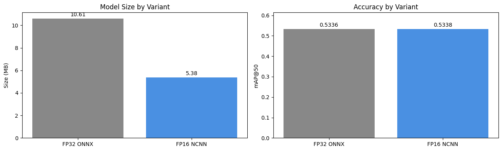

# Edge AI Traffic Analytics and violation Detection

> **Real-time helmet violation, triple-riding, overspeeding, congestion, and pothole detection on a Raspberry Pi 5 - no cloud, no internet, pure edge AI.**

[](https://python.org)
[](https://docs.ultralytics.com)
[](https://raspberrypi.com)
[](LICENSE)

**Course:** CP 330 - Edge AI | **Term:** Jan-Apr 2026 | **Institution:** IISc Bangalore

---

## What This System Does

| Task | Detection | Method |
|------|-----------|--------|
| **Helmet Violation** | Riders without helmets | IoU-based rider-to-bike association |
| **Triple Riding** | >2 persons on a motorcycle | Head counting per bike bounding box |
| **Overspeeding** | Vehicles exceeding speed limit | Homography-based pixel-to-world speed estimation |
| **Traffic Volume** | Vehicle counting by category | ByteTrack persistent tracking |
| **Congestion Level** | LOS A-F classification | Density + average speed algorithm |
| **Pothole Detection** | Road surface defects | YOLOv8n object detection |

---

## Architecture

```
                    +---------------------------+
                    |    Raspberry Pi 5 (8GB)   |
                    |                           |
  PiCamera ------>  |  +--------+ +--------+    | ----> Annotated Video
  (1280x720)        |  |Pipeline| |Pipeline|    | ----> Speed Plot (PNG)
                    |  |   1    | |   2    |    | ----> CSV Statistics
                    |  |Helmet  | |Traffic |    |
                    |  |NCNN    | |NCNN    |    |
                    |  +--------+ +--------+    |
                    |  +--------------------+   |
                    |  |   Pipeline 3       |   |
                    |  |   Pothole/Signs    |   |
                    |  +--------------------+   |
                    +---------------------------+
```

---

## Repository Structure

```
edge-ai-traffic-monitor/
    README.md                                   This file
    report.md                                   Full project report (12 sections)
    submission.txt                              Submission metadata
    requirements.txt                            Training dependencies
    requirements_rpi.txt                        Raspberry Pi dependencies
    LICENSE
    .gitignore

    pipelines/
        pipeline1_helmet_violation/
            training_and_compression.ipynb      YOLOv8n on merged Roboflow datasets
        pipeline2_vehicle_tracking/
            training_and_compression.ipynb      YOLOv11n on UVH-26 dataset
        pipeline3_pothole_detection/
            Pothole_01_data                     Prepares and cleans the pothole dataset. 
            Pothole_02_model_train              Handles the transfer learning process using YOLOv8n.
            Pothole_03_export_quantize          Compresses the heavy PyTorch model into lightweight edge formats.
            Pothole_04_edge_inference           The standalone live inference script
            best.pt                             The native, uncompressed PyTorch weights generated after training.
            best.onnx                           The compressed FP16 ONNX model

    deployment/
        traffic_monitor.py                      Unified inference (all 3 models)
        calibrate_homography.py                 Interactive speed calibration tool

    outputs/
        speed_distribution.png                  Sample speed distribution plot
        stats_sample.csv                        Sample per-frame statistics

    docs/
        figures/                                Report figures and demo images
        presentation/                           PPT slide script

```

---

## Quick Start

### 1. Clone this repository
```bash
git clone https://github.com/Prince-IISc-CalUniv/Edge-AI-Traffic-Analytics-and-violation-Detection.git
cd Edge-AI-Traffic-Analytics-and-violation-Detection

```

### 2. Train the models (on Kaggle GPU)

**Pipeline 1 (Helmet and tripple ride Detection):**
- Open `pipelines/pipeline2_helmet_violation/training_and_compression.ipynb` in Kaggle
- Enable GPU, run all cells
- Download `helmet_ncnn_model/` folder

**Pipeline 2 (Vehicle Tracking):**
- Open `pipelines/pipeline1_vehicle_tracking/training_and_compression.ipynb` in Kaggle
- Enable GPU (T4), run all cells
- Download the exported `best_ncnn_model/` folder
  
**Pipeline 3 (Pothole Detection):**
```bash
python src/Pothole_01_data.py
python src/Pothole_02_model_train.py
python src/Pothole_03_export_quantize.py
```

### 3. Deploy on Raspberry Pi 5

```bash
pip install -r requirements_rpi.txt

python deployment/calibrate_homography.py \
    --image reference_frame.jpg --width 7.0 --length 20.0

python deployment/traffic_monitor.py \
    --source picam \
    --model best_ncnn_model \
    --helmet-model helmet_ncnn_model \
    --pothole-model best.onnx \
    --speed-limit 60 \
    --calib calibration.json

python src/Pothole_04_edge_inference.py \
    --source picam \
    --model best.onnx

```

### 4. View outputs
```
outputs/
    annotated_YYYYMMDD_HHMMSS.mp4   Annotated video
    speed_YYYYMMDD_HHMMSS.png       Speed distribution
    stats_YYYYMMDD_HHMMSS.csv       Per-frame statistics
```

---

## Results Summary

### Model Performance

| Model | Architecture | mAP50 | Size (.pt) | Size (Compressed) | Format |
|-------|-------------|-------|------------|-------------------|--------|
| Pipeline 1 | YOLOv11n | 0.81 | 6.2 MB | 3.2 MB | NCNN FP16 |
| Pipeline 2 | YOLOv8n | 0.82 | 6.2 MB | 3.2 MB | NCNN FP16 |
| Pipeline 3 | YOLOv8n | 0.75 | 6.2 MB | 3.2 MB | ONNX/TFLite FP16 |

### On-Device Performance (Raspberry Pi 5)

| Metric | Value |
|--------|-------|
| Frame Rate | 2-3.5 FPS |
| Per-Model Latency | 120-180 ms |
| Total RAM | ~1.2 GB |
| CPU Usage | 75-85% |

---

## Sample Outputs

### Vehicle Detection


*Vehicle detection and classification across 14 categories on Indian urban traffic.*

### Helmet Violation Detection


*Helmet and rider detection at a traffic intersection.*


*Color-coded violation report: green = safe, red = violation.*

### Speed Distribution


*Speed histogram with overspeeding threshold marked.*

### Pothole Detection


*Pothole detection with bounding box annotations.*

### Model Compression


*PyTorch to NCNN FP16 compression pipeline.*

---

## Dataset Sources

| Pipeline | Source | Link |
|----------|--------|------|
| Pipeline 1 | Roboflow Universe (4 datasets) | Rider Helmet Detection (Yosia Aser) - [Roboflow Universe](https://universe.roboflow.com/yosia-aser-2io7g/rider-helmet-detection-y7nuk), Bike Helmet (Santhosh) - [Roboflow Universe](https://universe.roboflow.com/santhosh/bike-helmet-thiap), Helmet-Bike (wangbo) - [Roboflow Universe](https://universe.roboflow.com/wangbo/helmet-bike-0jtkl), Helmet Rider Detection (CS 174) - [Roboflow Universe](https://universe.roboflow.com/cs-174-paper-1/helmet-rider-detection-y30qv) |
| Pipeline 2 | UVH-26 (HuggingFace) | [iisc-aim/UVH-26](https://huggingface.co/datasets/iisc-aim/UVH-26) |
| Pipeline 3 | Kaggle | [Indian Roads Dataset (mitangshu11)](https://www.kaggle.com/datasets/mitangshu11/indian-roads-dataset) |

---

## License

This project is licensed under the MIT License. See [LICENSE](LICENSE) for details.

---

## Full Report

See [report.md](report.md) for the complete project report with all 12 sections as per the course template.
