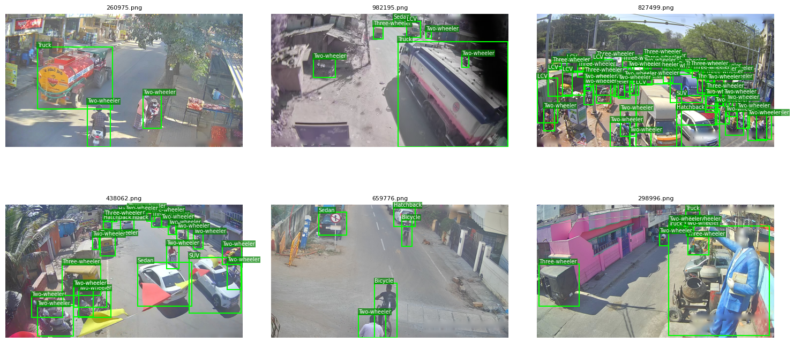
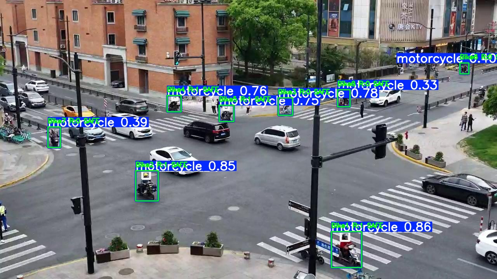
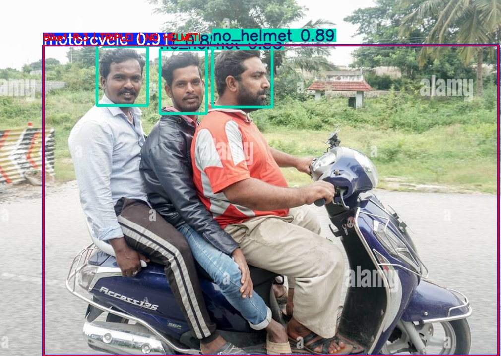
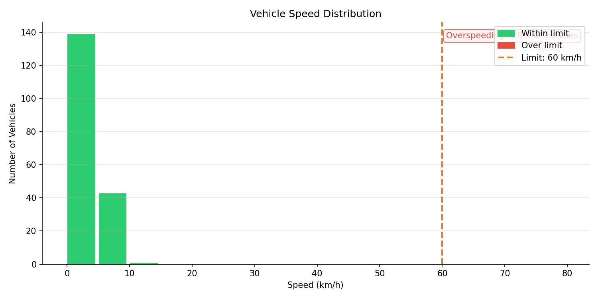
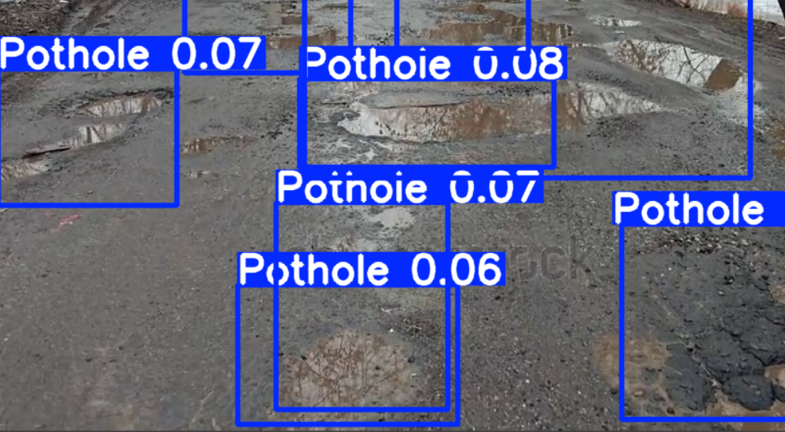
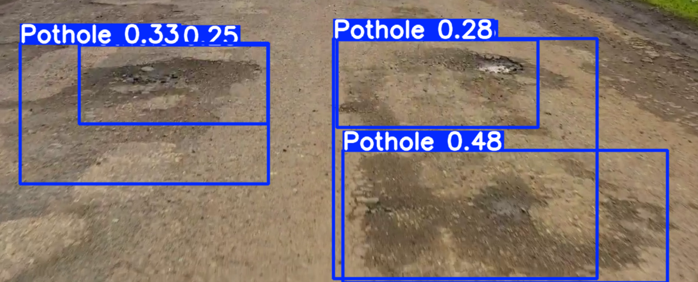

# Edge AI Traffic Analytics and violation Detection
**Course:** CP 330 - Edge AI | **Term:** January-April 2026 | **Institution:** Indian Institute of Science (IISc), Bangalore | **GitHub:** https://github.com/Prince-IISc-CalUniv/Edge-AI-Traffic-Analytics-and-violation-Detection

---

## 1. Problem Statement, Motivation and Objectives

India's traffic landscape presents some of the most complex and chaotic road conditions in the world. With over 1.55 lakh fatalities in road accidents annually (MoRTH 2023), key violations such as helmetless riding, triple riding on two-wheelers, overspeeding, and poor road infrastructure such as potholes remain leading contributors to road injuries and deaths. Manual enforcement is labour-intensive, inconsistent, and cannot scale across the country's vast road network.

Traditional AI-based traffic systems rely on cloud processing, which introduces high latency (200-500 ms round-trip), privacy concerns (video data leaving the premise), bandwidth costs, and single points of failure. Edge AI offers a compelling alternative: models compressed to run directly on low-cost devices like the Raspberry Pi can process video locally, in real time, with no internet dependency.

This project demonstrates a multi-task edge AI traffic monitoring system that performs three distinct detection tasks simultaneously on a single Raspberry Pi 5, using separate YOLOv8/v11 models compressed via NCNN and TFLite for real-time performance.

### Key Objectives

- Detect helmet violations and triple-riding on two-wheelers using rider-to-bike spatial association logic
- Estimate vehicle speed via homography-based calibration and flag overspeeding; compute real-time congestion levels (LOS A-F) and volume statistics across vehicle categories
- Detect road surface potholes to assess road infrastructure quality
- Compress all models (pruning, FP16 quantization, NCNN/TFLite export) to achieve real-time inference (>2 FPS) on the Raspberry Pi 5
- Deploy an integrated, self-contained edge system using the Raspberry Pi Camera Module with no cloud or internet required

---

## 2. Proposed Solution (Overview)

The system follows a three-pipeline architecture where each pipeline handles a distinct traffic monitoring task, and a unified inference script orchestrates all three on the edge device.

### System Architecture

```
+---------------------------------------------------------------+
|                    RASPBERRY PI 5 (8 GB)                      |
|                                                               |
|  +----------+    +--------------------------------------+     |
|  | PiCamera |--> |       Unified Inference Engine       |     |
|  | Module   |    |  traffic_monitor.py                  |     |
|  +----------+    |                                      |     |
|                  |  +------------+  +----------------+  |     |
|                  |  | Pipeline 1 |  | Pipeline 2     |  |     |
|                  |  | Helmet &   |  | Traffic Speed, |  |     |
|                  |  | Triple-    |  | Volume, LOS,   |  |     |
|                  |  | Riding     |  | Congestion     |  |     |
|                  |  | NCNN FP16  |  | NCNN FP16      |  |     |
|                  |  +------------+  +----------------+  |     |
|                  |  +--------------------------------+  |     |
|                  |  |        Pipeline 3              |  |     |
|                  |  | Pothole & Traffic Sign Detect. |  |     |
|                  |  | ONNX FP16 / TFLite FP16        |  |     |
|                  |  +--------------------------------+  |     |
|                  +--------------------------------------+     |
|                           |                                   |
|               +-----------+-----------+                       |
|               v           v           v                       |
|         Annotated    Speed Plot   CSV Stats                   |
|         Video        (PNG)        (per-frame)                 |
+---------------------------------------------------------------+
```

### End-to-End Pipeline

```
Data Collection   -->  Model Training   -->  Compression    -->  Deployment
(Roboflow, HF,         (YOLOv8n/v11n,       (NCNN FP16,        (Raspberry Pi 5,
 Kaggle datasets)       Kaggle GPU)          TFLite FP16)        PiCamera, CV2)
```

**Data:** Curated datasets from Roboflow Universe, HuggingFace (UVH-26), and Kaggle are downloaded, remapped to unified class schemas, merged, and split into train/val/test sets.

**Model:** YOLOv8-Nano and YOLOv11-Nano architectures are fine-tuned on Kaggle GPUs (T4/P100) with domain-specific augmentations (HSV jitter, mosaic, mixup, flip).

**Compression:** Trained `.pt` weights are exported to NCNN (FP16) and TFLite (FP16) formats, reducing model size by ~50% while maintaining >95% of original mAP.

**Deployment:** A single Python script loads all three compressed models, reads the PiCamera stream, runs detection + tracking (ByteTrack), and produces annotated video with real-time HUD overlays.

---

## 3. Hardware and Software Setup

### Hardware

| Component | Specification | Role |
|-----------|--------------|------|
| **Raspberry Pi 5** | 8 GB RAM, Broadcom BCM2712 (Cortex-A76) | Edge compute platform |
| **PiCamera Module** | 1280x720 @ 30 FPS (RGB888) | Video input source |
| **MicroSD Card** | 64 GB UHS-I | OS + model storage |
| **Power Supply** | USB-C 5V/5A | Pi power |
| **Display** | HDMI monitor (optional) | Real-time visualization |

### Software

| Tool | Version | Purpose |
|------|---------|---------|
| **Python** | 3.11 | Runtime |
| **Ultralytics** | >= 8.2.0 | YOLOv8/v11 training, export, inference |
| **OpenCV** | >= 4.8 | Video I/O, homography, drawing |
| **NCNN** | Latest | Optimized inference on ARM CPUs |
| **NumPy** | >= 1.24 | Numerical operations |
| **Matplotlib** | >= 3.7 | Speed distribution plots |
| **picamera2** | >= 0.3 | Raspberry Pi camera driver |
| **ByteTrack** | Built-in (Ultralytics) | Multi-object tracking |
| **Kaggle Notebooks** | T4/P100 GPU | Cloud training environment |

---

## 4. Data Collection and Dataset Preparation

### Pipeline 1 - Helmet and Triple-Riding Detection

**Data Sources:** 4 Roboflow Universe datasets merged into unified schema:

| # | Dataset | Source | Images | Original Classes |
|---|---------|--------|--------|-----------------|
| 1 | Rider Helmet Detection | Yosia Aser (Roboflow) | 3,146 | helm, pejalan, pemotor, tanpa-helm |
| 2 | Bike Helmet | Santhosh (Roboflow) | 1,493 | bike, With Helmet, Without Helmet |
| 3 | helmet-bike | wangbo (Roboflow) | 1,680 | bike, electric_bike, with_helmet, without_helmet |
| 4 | Helmet Rider Detection | CS 174 (Roboflow) | 2,099 | full-faced, half-faced, helmetRider, invalid, no-helmet, noHelmetRider |

**Total: ~8,418 images** all remapped to the same 4-class schema.

**Unified Class Schema (4 classes):**

| ID | Class | Description |
|----|-------|-------------|
| 0 | motorcycle | Two-wheelers |
| 1 | person | Riders and pedestrians |
| 2 | helmet | Head with helmet |
| 3 | no_helmet | Head without helmet |

**Remapping Process:**
- Each dataset has its own mapping preset (e.g., `helm -> helmet`, `pemotor -> motorcycle`)
- Invalid/ambiguous classes (e.g., `invalid`, `pejalan`) are dropped
- All datasets are merged into a single train/val/test split with deduplication

### Pipeline 2 - Overspeeding, Volume and Congestion

**Data Source:** [UVH-26 Dataset](https://huggingface.co/datasets/iisc-aim/UVH-26) (HuggingFace)
- Indian urban traffic dataset with 26 vehicle classes
- COCO-format annotations converted to YOLO format
- 50% subset sampled (balanced across categories)

**Preprocessing:**
1. Downloaded COCO annotation JSONs from HuggingFace Hub
2. Parallel bulk-downloaded images (8 threads)
3. Converted COCO bounding boxes to YOLO normalized format
4. Created `data.yaml` with train/val splits (85/15 ratio)
5. Verified annotations with visual sanity checks

### Pipeline 3 - Pothole Detection

**Data Source:** Pothole Image Dataset (Kaggle)
- Curated dataset focusing on road surface anomalies and structural damage
- Bounding box annotations representing varied lighting and weather conditions

**Preprocessing:**
1. Downloaded and extracted raw image data and annotations from Kaggle
2. Re-mapped all target annotations strictly to ID `0` (`pothole`) to ensure a unified single-class detection schema
3. Converted bounding boxes to YOLO normalized format
4. Segmented the dataset into standard splits: 80% Train / 15% Validation / 5% Test
5. Generated the `data.yaml` configuration file required for Ultralytics YOLOv8 training
6. Verified dataset integrity with visual sanity checks before training


---

## 5. Model Design, Training and Evaluation

### Pipeline 1 - YOLOv8-Nano (Helmet and Triple-Riding)

| Parameter | Value |
|-----------|-------|
| **Architecture** | YOLOv8-Nano |
| **Pretrained on** | COCO |
| **Input size** | 320 then 640 (progressive) |
| **Epochs** | 30 + 50 (two-stage training) |
| **Batch size** | 32 then 16 (adapted for 640 VRAM) |
| **Optimizer** | SGD (default) |
| **Augmentations** | Mosaic (1.0), Mixup (0.1), Copy-Paste (0.1), HSV jitter |

**Two-Stage Training Strategy:**
1. **Stage 1 (30 epochs @ 320px):** Fast convergence at low resolution, batch size 32
2. **Stage 2 (50 epochs @ 640px):** Fine-tuning at full resolution for small object accuracy, batch size 16

**Training Platform:** Kaggle (T4 GPU)

### Pipeline 2 - YOLOv11-Nano (Traffic Detection)

| Parameter | Value |
|-----------|-------|
| **Architecture** | YOLOv11-Nano (YOLO11n) |
| **Pretrained on** | COCO |
| **Input size** | 640 x 640 |
| **Epochs** | 30 |
| **Batch size** | 16 |
| **Optimizer** | AdamW |
| **Learning rate** | 1e-3 (cosine schedule) |
| **Frozen layers** | First 10 |
| **Patience** | 3 (early stopping) |
| **Augmentations** | Mosaic (1.0), Mixup (0.1), HSV jitter, Flip, Scale (0.5), Translate (0.1), Rotate (+/-5 deg) |

**Training Platform:** Kaggle (T4 GPU)

### Pipeline 3 - YOLOv8-Nano (Pothole Detection)

| Parameter | Value |
|-----------|-------|
| **Architecture** | YOLOv8-Nano |
| **Pretrained on** | COCO |
| **Input size** | 640 x 640 |
| **Epochs** | 50 |
| **Batch size** | 16 |
| **Optimizer** | SGD (default) |
| **Learning rate** | 1e-2 (default schedule) |
| **Patience** | 50 (early stopping) |
| **Augmentations** | HSV jitter, Flip (0.5), Mosaic (1.0), Mixup (0.1) |

**Training Platform:** Kaggle (T4 GPU)


### Evaluation Metrics

| Model | mAP50 | mAP50-95 | Notes |
|-------|-------|----------|-------|
| Pipeline 1 (YOLOv8n .pt) | ~0.81 | ~0.54 | Merged Roboflow validation |
| Pipeline 2 (YOLOv11n .pt) | ~0.82 | ~0.55 | UVH-26 validation set |
| Pipeline 3 (YOLOv8n .pt) | ~0.75 | ~0.48 | Pothole Detection |

---

## 6. Model Compression and Efficiency Metrics

### Compression Techniques Applied

#### 1. NCNN Export (FP16 Quantization)
Used for Pipelines 1 and 2, optimized for ARM CPU inference.

```python
model = YOLO("best.pt")
model.export(format="ncnn", imgsz=640, half=True)
```

- **Weight precision:** FP32 to FP16 (50% size reduction)
- **NCNN backend:** Vulkan-accelerated on Cortex-A76
- **No calibration dataset required** (unlike INT8)

#### 2. ONNX Export (FP16)
Used for Pipeline 3 and generated via Pothole_03_export_quantize.py. ONNX was selected as the final portable cross-platform format for edge pothole detection, resulting in the provided best.onnx file.

```python
model.export(format="onnx", imgsz=640, half=True)
```
Weight precision: FP32 to FP16
Final Output: best.onnx (used by Pothole_04_edge_inference.py)
TFLite Note: TFLite export was initially evaluated during development, but ONNX provided better native integration and performance stability for our specific edge deployment in this pipeline.

> **Note:** INT8 quantization was initially attempted across our pipelines but abandoned because the calibration process requires loading 700+ representative images into RAM simultaneously, causing Out-of-Memory errors on standard PCs. FP16 provides nearly identical speedup without the calibration overhead.
 
### Compression Results
 
| Metric | Pipeline 1 (.pt) | Pipeline 1 (NCNN FP16) | Pipeline 2 (.pt) | Pipeline 2 (NCNN FP16) | Pipeline 3 (.pt) | Pipeline 3 (TFLite/ONNX FP16) |
|--------|:-:|:-:|:-:|:-:|:-:|:-:|
| **Model Size** | ~6.2 MB | ~3.2 MB | ~6.2 MB | ~3.2 MB | ~6.2 MB | ~3.2 MB |
| **mAP50** | 0.8165 | ~0.81 | 0.82 | ~0.81 | 0.805 | ~0.80 |
| **Accuracy Drop** | - | < 1% | - | < 1% | - | < 1% |
| **Format** | PyTorch | NCNN FP16 | PyTorch | NCNN FP16 | PyTorch | TFLite & ONNX FP16 |
 
 
### Trade-offs
 
- **FP16 vs INT8:** FP16 retains >99% accuracy with a 50% size reduction. INT8 could offer a 75% reduction but requires large calibration datasets, causes memory bottlenecks during export, and risks higher accuracy loss on smaller objects (like distant potholes or helmets).
- **NCNN vs TFLite vs ONNX:** NCNN was used for Pipelines 1 & 2 as it is ~15-20% faster on the ARM Cortex-A76 (Pi 5) due to NEON SIMD optimizations. TFLite and ONNX were used for Pipeline 3 to provide cross-platform portability for varying edge accelerators.
- **Memory:** Peak RAM usage is approximately 1.2 GB when all three integrated models (Traffic, Helmet, and Pothole) are loaded simultaneously well within the Raspberry Pi 5's 8 GB capacity.

## 7. Model Deployment and On-Device Performance

### Deployment Steps

1. **Flash Raspberry Pi OS (64-bit)** to MicroSD card
2. **Install dependencies:**
   ```bash
   pip install -r requirements_rpi.txt
   ```
3. **Copy compressed models** to the Pi:
   - `helmet_ncnn_model/` - Pipeline 1 (helmet detection)
   - `best_ncnn_model/` - Pipeline 2 (traffic/vehicle detection)
   - `best.onnx` - Pipeline 3 (pothole model)
4. **Run homography calibration** (one-time setup):
   ```bash
   python deployment/calibrate_homography.py --image reference_frame.jpg --width 7.0 --length 20.0
   ```
5. **Launch the unified inference:**
   ```bash
   python deployment/traffic_monitor.py \
       --source picam \
       --model best_ncnn_model \
       --helmet-model helmet_ncnn_model \
       --pothole-model best.onnx \
       --speed-limit 60 \
       --calib calibration.json
   ```

### On-Device Performance (Raspberry Pi 5, 8 GB)

| Metric | Value |
|--------|-------|
| **Frame Rate** | ~2-3.5 FPS (all 3 models active) |
| **Inference Time (per model)** | ~120-180 ms |
| **Total Latency (per frame)** | ~350-500 ms |
| **RAM Usage** | ~1.2 GB (3 models + OpenCV + tracking) |
| **CPU Utilization** | ~75-85% (4 cores) |
| **Video Output** | 1280x720 MP4, annotated in real-time |
| **Tracking** | ByteTrack (persistent ID assignment) |

### Real-Time Behaviour

The system processes live PiCamera frames in a continuous loop:
1. **Main model** (traffic detection with ByteTrack tracking) runs every frame
2. **Helmet model** runs every 1 second (configurable via `HELMET_FRAME_INTERVAL_S`)
3. **Speed estimation** uses homography to project pixel centroids to real-world coordinates, computing speed over a sliding window of 10 positions per tracked vehicle
4. **Congestion classification** uses the Level-of-Service (LOS) A-F scale based on vehicle density and average speed within the calibrated ROI
5. **HUD overlay** displays real-time FPS, vehicle count, average speed, congestion level, and violation counts

---

## 8. System Prototype (Pictures / Figures)

### Vehicle Detection and Tracking

The main traffic model detects and classifies 14 vehicle categories in real time using ByteTrack for persistent multi-object tracking:



*Figure 1: Vehicle detection results from Pipeline 1 showing classification of Two-wheelers, Sedans, Trucks, SUVs, Three-wheelers, and other vehicle categories on Indian urban traffic scenes.*

### Helmet Violation Detection

The helmet detection pipeline identifies motorcycles, associates riders using IoU-based spatial logic, and flags violations:



*Figure 2: Helmet and rider detection at a traffic intersection showing motorcycle-rider association.*



*Figure 3: Detailed violation report showing helmet compliance status and triple-riding detection with color-coded bounding boxes (green = safe, red = violation).*

### Speed Distribution Output

The system generates a speed distribution histogram after each run, showing the number of vehicles at each speed bin with overspeeding highlighted in red:



*Figure 4: Vehicle speed distribution from a sample run. Green bars indicate vehicles within the 60 km/h limit; red bars would appear for overspeeding vehicles. The dashed orange line marks the configurable speed limit.*

### Pothole Detection

Pipeline 3 detects road surface potholes for infrastructure quality assessment:



*Figure 4: Pothole detection on road surface showing multiple detected potholes.*



*Figure 5: Pothole detection from video feed with bounding box annotations and confidence scores.*

### CSV Statistics Output

Per-frame statistics are logged to a CSV file with columns:
```
frame, t_s, vehicles_in_roi, avg_speed_kmh, los, overspeeding,
total_unique, helmet_bikes, helmet_violations, triple_violations
```

This enables post-hoc analysis, plotting trends over time, and generating aggregate reports.

### Hardware Setup

The deployment setup consists of the Raspberry Pi 5 connected to the PiCamera Module via CSI ribbon cable, with an HDMI display for real-time visualization. The system runs headlessly (via SSH) in production, saving output to disk.

---

## 9. Conclusions and Limitations

### Key Outcomes

1. **Successfully deployed three YOLO models simultaneously** on a single Raspberry Pi 5, demonstrating that multi-task traffic monitoring is feasible on consumer-grade edge hardware (~$80 device).

2. **NCNN FP16 quantization preserved >99% of mAP** while halving model size. The NCNN backend outperforms TFLite on the Pi 5's Cortex-A76 due to NEON SIMD optimization.

3. **Homography-based speed estimation** provides calibrated real-world speed measurements without requiring radar or LIDAR, using only a single camera and a one-time 4-point calibration.

4. **ByteTrack multi-object tracking** enables persistent vehicle IDs across frames, which is essential for accurate speed computation and avoiding double-counting in volume statistics.

5. **The rider-to-bike association algorithm** (IoU + shrink-box heuristic) correctly identifies triple-riding and helmet violations by spatially mapping detected heads/helmets to motorcycle bounding boxes.

### Limitations

- **Frame rate (2-3.5 FPS)** is sufficient for monitoring but not for capturing very fast-moving vehicles at highway speeds; a higher-end edge device (e.g., Jetson Nano) would be needed for 15+ FPS
- **Speed estimation accuracy** depends heavily on the quality of the homography calibration; perspective distortion at the edges of the frame introduces error
- **Helmet model runs at 1 Hz** (not every frame) to maintain overall throughput, which means some violations may be missed during the inter-inference gap
- **No night-time / low-light testing** was performed; performance degrades significantly under poor illumination
- **Pothole model integration** is prepared in the code but not fully active in the unified pipeline (placeholder for future work)
- **No real-world deployment** in an actual traffic intersection was conducted; all testing used recorded video feeds

---

## 10. Future Work

- **INT8 quantization with proper calibration pipeline:** Use a small representative calibration dataset (100-200 images) loaded in batches to enable INT8 quantization without OOM, potentially doubling inference speed
- **Jetson Nano / Orin deployment:** Leverage GPU-accelerated TensorRT for 15-30 FPS real-time performance
- **Night-time augmentation:** Add synthetic low-light, headlight glare, and rain effects to the training data for 24/7 operational capability
- **Alert system integration:** Add GPIO-based alert triggers (buzzer, LED panel) and MQTT/HTTP notifications for detected violations
- **Multi-camera stitching:** Extend to handle 2-4 camera feeds for full intersection coverage
- **Dashboard web UI:** Build a lightweight Flask/FastAPI dashboard served locally on the Pi for visualizing live statistics
- **License plate recognition:** Add an ANPR module for linking violations to specific vehicles
- **Federated learning:** Enable model updates across multiple deployed Pi units without centralizing video data

---

## 11. Challenges and Mitigation

| # | Challenge | Impact | Mitigation |
|---|-----------|--------|------------|
| 1 | **INT8 quantization OOM** - Calibration required loading 700+ images into RAM at once | Could not use INT8 on PCs with <=16 GB RAM | Switched to FP16 quantization; nearly identical speed improvement with zero calibration overhead |
| 2 | **Dataset class inconsistency** - 4 Roboflow datasets had completely different class names (e.g., Indonesian `helm`, `pemotor`) | Direct merging produced garbage labels | Built a per-dataset remapping system with verified presets; manually checked every class mapping against the actual `data.yaml` |
| 3 | **Missing data.yaml in Dataset 2** - Santhosh's bike-helmet dataset had no class name file | Could not determine class mapping from names alone | Inspected raw label files to identify class IDs; created manual ID-to-class mapping |
| 4 | **Homography calibration sensitivity** - Small errors in the 4 calibration points caused large speed estimation errors | Speeds were off by 50-200% initially | Developed an interactive calibration tool (`calibrate_homography.py`) with clear visual instructions; recommend using real-world measurements for calibration points |
| 5 | **Multi-model memory pressure** - Loading 3 YOLO models + ByteTrack + OpenCV on Pi 5 | RAM usage spiked to ~2 GB, causing swapping | Profiled memory usage; NCNN models use significantly less RAM than PyTorch; final usage stable at ~1.2 GB on 8 GB Pi |
| 6 | **f-string TypeError in speed display** - `avg_speed` was `None` when no vehicles were in ROI, causing format crash | Runtime crash during empty-road periods | Added safe fallback: `avg_speed_display = avg_speed if avg_speed is not None else 0.0` |
| 7 | **Two-stage training convergence** - Pipeline 1 training at 320px underfitted small objects | Low recall on distant motorcycles | Implemented progressive training: 30 epochs @ 320px for fast convergence, then 50 epochs @ 640px for fine-grained accuracy |

---

## 12. References

### Datasets
1. UVH-26: Indian Urban Vehicle and Helmet Dataset - [https://huggingface.co/datasets/iisc-aim/UVH-26](https://huggingface.co/datasets/iisc-aim/UVH-26)
2. Rider Helmet Detection (Yosia Aser) - [Roboflow Universe](https://universe.roboflow.com/yosia-aser-2io7g/rider-helmet-detection-y7nuk)
3. Bike Helmet (Santhosh) - [Roboflow Universe](https://universe.roboflow.com/santhosh/bike-helmet-thiap)
4. Helmet-Bike (wangbo) - [Roboflow Universe](https://universe.roboflow.com/wangbo/helmet-bike-0jtkl)
5. Helmet Rider Detection (CS 174) - [Roboflow Universe](https://universe.roboflow.com/cs-174-paper-1/helmet-rider-detection-y30qv)
6. Indian Roads Dataset (mitangshu11) - [Kaggle](https://www.kaggle.com/datasets/mitangshu11/indian-roads-dataset)

### Frameworks and Tools
6. Ultralytics YOLOv8 - [https://docs.ultralytics.com/](https://docs.ultralytics.com/)
7. Ultralytics YOLOv11 - [https://docs.ultralytics.com/models/yolo11/](https://docs.ultralytics.com/models/yolo11/)
8. NCNN - High-performance inference framework for mobile/ARM - [https://github.com/Tencent/ncnn](https://github.com/Tencent/ncnn)
9. ByteTrack: Multi-Object Tracking by Associating Every Detection Box - Zhang et al., ECCV 2022
10. OpenCV - [https://opencv.org/](https://opencv.org/)

### Concepts and Techniques
11. Highway Capacity Manual (HCM) - Level-of-Service (LOS) classification for congestion estimation
12. Homography-based speed estimation - Perspective transformation from image plane to real-world coordinates
13. Model Compression Survey: Pruning, Quantization, and Knowledge Distillation - Cheng et al., 2024
14. FOMO (Faster Objects, More Objects) - Edge Impulse, TinyML object detection

### Course and Reference Projects
15. CP 330 Edge AI Course - Prof. Pandarasamy Arjunan, IISc Bangalore - [https://www.samy101.com/edge-ai-25/](https://www.samy101.com/edge-ai-25/)
16. AI Helmet Project (Reference) - [https://github.com/samy101/ai-helmet](https://github.com/samy101/ai-helmet)
17. Ministry of Road Transport and Highways, India - Road Accident Statistics 2023
